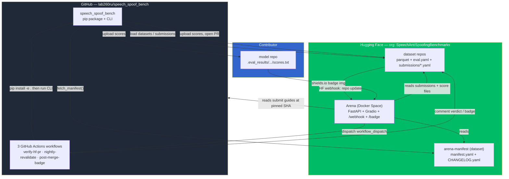

# Architecture Overview

This document is the map. Read it first; every other architecture doc zooms into one
box drawn here.

## What problem this solves

Anti-spoofing (a.k.a. audio deepfake detection) research is full of self-reported
numbers that nobody can reproduce: different test splits, different scoring code,
unpublished checkpoints. This project fixes that by making **every leaderboard number
recomputable from an immutable artifact**:

- Datasets are **pinned to a git commit SHA**, not a mutable branch.
- Score files are uploaded to the contributor's own repo and **pinned by commit + SHA-256**.
- A maintainer (and a nightly job) **re-downloads the scores and recomputes the metric**
  before — and after — anything appears on the board.

## The components

### 1. The pip package — `speech_spoof_bench` (GitHub)
The CLI and library that does the actual work: load a dataset, run a model, compute a
metric, write a result, validate/reproduce submissions, build badges, and run the CI
commands. Everything else is glue around it. → [package.md](package.md)

### 2. The dataset repos (HF)
Each is a self-contained HF *dataset* repo with parquet shards (`data/test-*.parquet`),
an `eval.yaml`, a README with `arena-ready` in its tags, and a `submissions/` folder
that accumulates one pointer-YAML per submitted system. The Arena discovers datasets by
reading the manifest, not by scanning tags. → [submission-lifecycle.md](submission-lifecycle.md)

### 3. The model repos (HF, contributor-owned)
Hold the immutable `scores.txt` files under `.eval_results/<dataset-org>/<dataset-name>/`.
The submission YAML points at a specific commit of this file. The project never hosts
score files itself.

### 4. `arena-manifest` (HF)
A single `manifest.yaml`: which datasets are Core vs Extended (each pinned to a SHA),
the tier definitions, the ranking knobs (gamma, absence-penalty), and the
`ranking_version`. The pip package validates it against a bundled JSON schema; both the
package and the Arena read it at runtime. → [versioning.md](versioning.md)

### 5. The Arena (HF Docker Space)
A FastAPI process that mounts a Gradio leaderboard UI at `/`, an HF webhook receiver at
`/webhook`, and dynamic badge endpoints at `/badge/{slug}/{tier|rank}.json`. It ingests
all submissions into an in-memory table, ranks them, and persists a `cache.json` snapshot
back into its own repo for fast cold-starts. → [arena.md](arena.md)

### 6. The CI/CD layer (GitHub Actions + the webhook)
Three workflows in the package repo, all invoked through the Arena's webhook (or cron).
They re-verify PRs, post badges on merge, and nightly-revalidate the whole board. →
[cicd.md](cicd.md)

## The end-to-end story (happy path)

1. **Develop.** Contributor writes a `MyModel(AntiSpoofingModel)` class.
2. **Run.** `speech-spoof-bench run --model-module my:MyModel --datasets <id>` →
   produces `results/<slug>/scores.txt` + a `result.yaml`.
3. **Upload.** They push `scores.txt` to their own model repo (pinned by commit).
4. **Submit.** `speech-spoof-bench submit ...` builds a v4 submission YAML (a *pointer*
   to the score file: URL + SHA-256, no audio, no labels) and opens a **PR on the dataset
   repo**, writing `submissions/<slug>.yaml`. The `reproduction:` block is left empty.
5. **Webhook.** HF sends a `repo.content` update event for `refs/pr/N` to the Arena's
   `/webhook`. The Arena dispatches the **`verify-hf-pr`** GitHub Action.
6. **Verify.** The Action `pip install -e .`s the package and runs
   `speech-spoof-bench ci verify-pr`, which schema-checks the YAML and runs
   `reproduce --scoring`: re-download the score file, check its SHA-256, stream the
   dataset's labels at the pinned revision, recompute the metric, and compare to the
   claimed value within `1e-6`. A ✅/❌ table is posted as an HF discussion comment.
7. **Merge.** A maintainer fills the `reproduction:` block and merges the PR.
8. **Badge.** The merge fires a `refs/heads/main` webhook → Arena dispatches
   **`post-merge-badge`**, which posts a paste-ready `result.yaml` + Markdown badge
   snippet to the discussion. The contributor pastes it into their model card.
9. **Re-rank.** The same merge triggers an Arena cache refresh: it re-reads the manifest
   and all submissions, recomputes the weighted Core-set mean, assigns tiers, and the
   leaderboard updates. The badge endpoints now serve a live tier + rank.
10. **Nightly.** At 06:00 UTC every day, **`nightly-revalidate`** walks every merged
    submission and re-runs `reproduce --scoring`; any drift opens a `stale-submission`
    GitHub issue.

## Trust boundaries (why each piece exists)

- **Pointer submissions** keep the dataset repos tiny — they store a URL + hash, never
  the multi-MB score files or audio.
- **Commit-pinned everything** (dataset revision, score URL, manifest entries) means a
  number can always be recomputed from exactly the inputs that produced it.
- **`reproduce --scoring` is cheap (~seconds, no GPU)** so it can gate every PR and run
  nightly. `reproduce --inference` (re-running the model end-to-end) is the expensive,
  optional upgrade — currently **not implemented** (raises `NotImplementedError`).
- **The manifest is data, not code** — changing tiers or ranking weights is a YAML edit
  plus a `ranking_version` bump, no package release.

## Where to go next

- The shapes of the data flowing through here → [submission-lifecycle.md](submission-lifecycle.md)
- The exact ranking maths → [arena.md](arena.md)
- Every secret and trigger → [cicd.md](cicd.md)
- "When do I have to bump X?" → [versioning.md](versioning.md)
</content>
